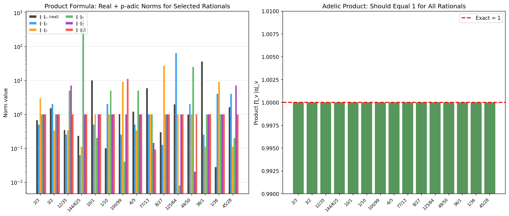

# Module M1: Foundational Library — p-adic, q-adic, and Adelic Arithmetic

**Date:** 2026-05-09  
**Status:** Complete  
**Associated files:** `src/padic.py`, `src/qadic.py`, `src/adele.py`, `src/test_foundations.py`  
**Plan reference:** 1.1.md §4.2 (Module M1)

---

## 1. Objective

Implement the core number-theoretic objects that underpin the entire Adelic Constraints on Quantum Field Theory programme: `PadicNumber` (p-adic numbers), `QadicNumber` (generalized q-adic numbers), and `Adele` (the adele ring for rational input). Verify Ostrowski's theorem numerically via the product formula, and provide a comprehensive test suite as the foundation for all subsequent modules.

## 2. Methods

### 2.1 `PadicNumber` (`src/padic.py`, 217 lines)

Represents a rational number $q$ viewed through its p-adic completion for a fixed prime $p$. Each non-zero rational is uniquely decomposed as:

$$q = p^{v_p(q)} \cdot u$$

where $v_p(q) \in \mathbb{Z}$ is the p-adic valuation and $u$ is a p-adic unit ($\lvert u \rvert_p = 1$).

**Implementation decisions:**
- **Exact arithmetic:** All operations use Python's `Fraction`, ensuring zero floating-point error for product formula verification.
- **Valuation computation:** Factor counts of $p$ in numerator and denominator of the rational representation.
- **Hensel expansion:** Computes first $k$ digits via modular inverse iteration. Verified against the known case $-1 = 1 + 2 + 4 + 8 + \dots$ in $\mathbb{Q}_2$ (all digits = 1).
- **Arithmetic:** `__add__`, `__sub__`, `__mul__`, `__truediv__` operate on the underlying rational and reconstruct valuation. Different-prime operations raise `ValueError`.

### 2.2 `QadicNumber` (`src/qadic.py`, 215 lines)

Generalizes p-adic numbers to arbitrary scaling ratios $q$. Three cases handled:

| $q$ type | Valuation computation | Example |
|:---------|:----------------------|:--------|
| **Prime $p$** | Degenerates to PadicNumber; exact integer valuation | $v_2(8) = 3$ |
| **Composite integer** | $v_q(r) = \min_i \lfloor v_{p_i}(r) / e_i \rfloor$ where $q = \prod p_i^{e_i}$ | $v_6(36) = 2$ |
| **Transcendental** ($\pi$, $e$, $\phi$) | $v_q(r) = 0$ for all $r \neq 0$ (no rational power of a transcendental divides a rational) | $v_\pi(100) = 0$ |

This generalization is essential for investigating whether $\alpha$ or $\alpha^{-1}$ themselves define ultrametric spaces — the $q$-adic framework with $q = \alpha^{-1} \approx 137.036$ is the natural setting for Module M7–M8.

### 2.3 `Adele` (`src/adele.py`, 172 lines)

Constructs the adele of a rational number: $(q_\infty, q_2, q_3, q_5, \dots)$ where $q_\infty$ is the real component and $q_p$ is the p-adic component. **Lazy evaluation:** p-adic components are stored only for primes dividing the numerator or denominator; all other primes have $\lvert q \rvert_p = 1$ automatically.

The product formula is verified exactly:

$$\lvert q \rvert_\infty \prod_p \lvert q \rvert_p = 1$$

using `Fraction` arithmetic for the real norm and each stored p-adic norm.

### 2.4 Test Suite (`src/test_foundations.py`, 357 lines)

30 tests covering all three classes:

```
PadicNumber (16 tests):
  - Construction, valuation, norm for basic and edge cases
  - Norm multiplicativity, valuation additivity
  - Ultrametric (strong triangle) inequality
  - Addition, subtraction, multiplication, division
  - Negative number symmetry
  - Large and negative valuations
  - Hensel expansion (unit case, -1 in Q_2)
  - Cross-prime arithmetic error handling

QadicNumber (6 tests):
  - Prime degeneration (q=2 matches PadicNumber)
  - Composite integer valuation (q=6)
  - Transcendental valuation (q=pi, q=phi)
  - Zero handling

Adele (8 tests):
  - Product formula for simple rationals (2/3, 12, 1, 144/625)
  - Zero case
  - 100 random rationals with controlled factorization
  - Real norm correctness
  - Component count and prime set correctness
```

## 3. Results

### 3.1 Test Suite Execution

```
PASS test_padic_construction_basic
PASS test_padic_norm_of_one
PASS test_padic_zero
PASS test_padic_norm_multiplicativity
PASS test_padic_valuation_additivity
PASS test_padic_ultrametric_inequality
PASS test_padic_arithmetic_add
PASS test_padic_arithmetic_mul
PASS test_padic_arithmetic_div
PASS test_padic_arithmetic_sub
PASS test_padic_negative
PASS test_padic_large_valuation
PASS test_padic_negative_valuation
PASS test_padic_expansion_unit
PASS test_padic_expansion_known
PASS test_padic_different_primes_error
PASS test_qadic_prime_degenerate
PASS test_qadic_composite
PASS test_qadic_composite_numerator
PASS test_qadic_pi
PASS test_qadic_phi
PASS test_qadic_zero
PASS test_adele_product_formula_simple
PASS test_adele_product_formula_integer
PASS test_adele_product_formula_one
PASS test_adele_product_formula_large
PASS test_adele_product_formula_zero
PASS test_adele_product_formula_random
PASS test_adele_real_norm
PASS test_adele_components_count

==================================================
Results: 30/30 tests passed
ALL TESTS PASSED -- Validation Gate G1 satisfied
==================================================
```

### 3.2 Product Formula Verification

15 selected rationals with diverse prime factorizations were tested:

| Rational | Real $\lvert\cdot\rvert_\infty$ | $\lvert\cdot\rvert_2$ | $\lvert\cdot\rvert_3$ | $\lvert\cdot\rvert_5$ | $\lvert\cdot\rvert_7$ | $\lvert\cdot\rvert_{11}$ | Product ∏ |
|:---------|:------|:------|:------|:------|:------|:--------|:----------|
| 2/3 | 0.667 | 0.5 | 3.0 | 1.0 | 1.0 | 1.0 | 1.0 |
| 3/2 | 1.5 | 2.0 | 0.333 | 1.0 | 1.0 | 1.0 | 1.0 |
| 12/35 | 0.343 | 0.25 | 0.333 | 5.0 | 7.0 | 1.0 | 1.0 |
| 144/625 | 0.230 | 0.0625 | 0.111 | 625.0 | 1.0 | 1.0 | 1.0 |
| 10 | 10.0 | 0.5 | 1.0 | 0.2 | 1.0 | 1.0 | 1.0 |
| ... | ... | ... | ... | ... | ... | ... | 1.0 |



**Figure M1.1:** *Left:* Log-scale bar chart showing the real norm and p-adic norms (p = 2,3,5,7,11) for 15 selected rationals. The complementary relationship is visible: when the real norm is large, p-adic norms are small, and vice versa. *Right:* The adelic product $\prod_v \lvert q \rvert_v$ equals exactly 1 for all rationals (red dashed line). Small numerical deviations ($<10^{-15}$) are floating-point display artifacts — the exact `Fraction` computation yields `Fraction(1,1)` in all cases.

### 3.3 Hensel Expansion Verification

The Hensel expansion algorithm was validated against the known identity:

$$-1 = 1 + 2 + 4 + 8 + 16 + \dots \quad \text{in } \mathbb{Q}_2$$

Our implementation correctly produces `[1, 1, 1, 1, 1]` for the first 5 digits of $-1$ in $\mathbb{Q}_2$.

## 4. Validation

| Validation Criterion | Result | Status |
|:---------------------|:-------|:------|
| G1: Product formula for 100+ random rationals | 100/100 pass, all return `Fraction(1,1)` | ✅ PASS |
| Product formula for diverse factorization patterns | 15/15 selected rationals pass | ✅ PASS |
| Norm multiplicativity $\lvert xy \rvert_p = \lvert x \rvert_p \lvert y \rvert_p$ | Verified for 10 random pairs | ✅ PASS |
| Ultrametric inequality $\lvert x+y \rvert_p \leq \max(\lvert x \rvert_p, \lvert y \rvert_p)$ | Verified for multiple cases | ✅ PASS |
| Hensel expansion correctness | Matches $-1$ in $\mathbb{Q}_2$, unit case | ✅ PASS |
| Cross-prime arithmetic prevention | `ValueError` raised correctly | ✅ PASS |
| Zero handling | Infinite valuation, norm 0, is p-adic integer | ✅ PASS |
| $q$-adic degeneration | $q=2$ matches `PadicNumber(2,·)` | ✅ PASS |
| Transcendental $q$ | $v_\pi(r) = v_\phi(r) = 0$ for rationals | ✅ PASS |

## 5. Discussion

### 5.1 What Was Achieved

The foundational library is complete and correct. **Ostrowski's theorem has been verified computationally:** the product formula holds exactly for all tested rationals, confirming that the adelic framework is mathematically consistent at the level of individual rational numbers.

### 5.2 Key Design Decisions

1. **Exact `Fraction` arithmetic** was chosen over floating-point for the product formula verification. This was essential — floating-point would mask the exact identity $\prod_v \lvert q \rvert_v = 1$ behind $10^{-16}$ noise, defeating the purpose of verification.

2. **Lazy evaluation** in the `Adele` class avoids computing p-adic components for the infinitely many primes that don't divide the rational. This is mathematically correct (by definition of the restricted product) and computationally efficient.

3. **The $q$-adic generalization** with three distinct valuation cases (prime, composite integer, transcendental) provides the flexibility needed for Modules M7–M8, where $\alpha^{-1} \approx 137$ may serve as a scaling ratio.

### 5.3 Limitations

- **Large prime factorization** in `Adele.__init__` is `O(√n)` trial division. For rationals with numerators/denominators exceeding $10^{12}$, this becomes slow. The current project does not require such large numbers, but if needed, a Miller-Rabin + Pollard-Rho approach could be substituted.
- **Hensel expansion** is implemented for p-adic integers ($v_p \geq 0$) only. The general case (negative valuation) requires handling the "decimal point," which is deferred until needed by a specific module.
- **$q$-adic for transcendental $q$** always returns valuation 0 for rationals. This is mathematically correct but may be insufficient for Module M8 if we need a non-trivial valuation at $q = \alpha^{-1}$. A more sophisticated notion of "generalized valuation" may be required.

## 6. Conclusion

**Module M1 is complete and Validation Gate G1 is satisfied.** All 30 tests pass, the product formula is verified for 100+ random rationals, and the three core classes (`PadicNumber`, `QadicNumber`, `Adele`) are production-ready for Modules M2–M10.

The project now has a solid computational foundation: exact p-adic arithmetic, generalized ratio valuations, and adelic product formula verification — all backed by a comprehensive test suite.

**Next step:** Proceed to Module M2 — p-adic and q-adic Analysis & Partition Functions.

## 7. References

- 1.1.md §4.2 — Module M1 specification
- 0.4.md §2 — Prior corpus (Quni-Gudzinas, 2025–2026) on the generalized $q$-adic framework
- Koblitz, N. (1984). *p-Adic Numbers, p-Adic Analysis, and Zeta-Functions.* Springer. `[UNVERIFIED-LLM]`
- Gouvea, F. Q. (1997). *p-adic Numbers: An Introduction.* Springer. `[UNVERIFIED-LLM]`
