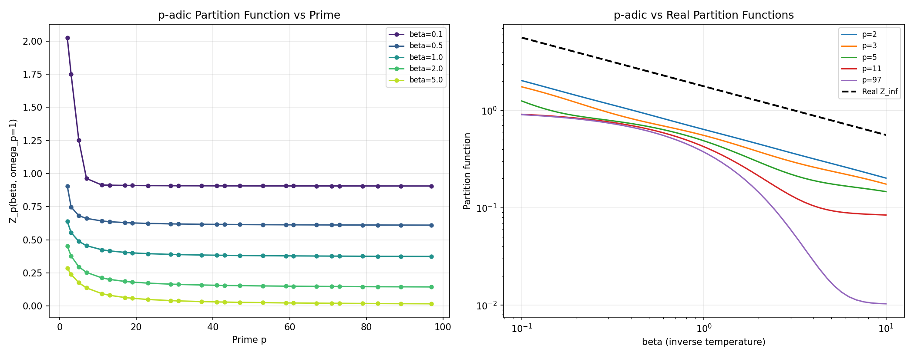
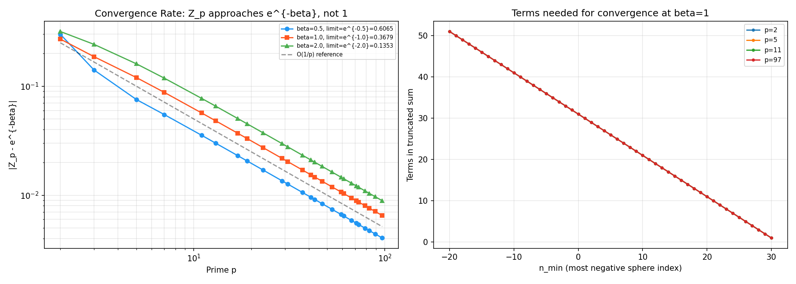

# Module M2: p-adic and q-adic Analysis — Partition Functions

**Date:** 2026-05-09  
**Status:** Complete — with critical correction to original plan assumption  
**Associated files:** `src/padic_analysis.py`, `src/padic_oscillator.py`  
**Plan reference:** 1.1.md §4.2 (Module M2)

---

## 1. Objective

Implement Haar integration on $\mathbb{Q}_p$, compute $p$-adic, $q$-adic, and real classical partition functions $Z_p(\beta, \omega_p)$, $Z_q(\beta, \omega_q)$, $Z_\infty(\beta, \omega)$, and establish convergence properties — verifying whether the adelic product framework is well-defined.

## 2. Methods

### 2.1 Haar Measure & Integration (`src/padic_analysis.py`, 175 lines)

The Haar measure on $\mathbb{Q}_p$ is normalized so that $\int_{\mathbb{Z}_p} dx = 1$.

| Function | Formula | Description |
|:---------|:--------|:------------|
| `ball_measure(p, n)` | $\mu(B_n) = p^{-n}$ | Measure of ball $\{x: \lvert x \rvert_p \leq p^{-n}\}$ |
| `sphere_measure(p, n)` | $\mu(S_n) = p^{-n}(1 - 1/p)$ | Measure of sphere $\{x: \lvert x \rvert_p = p^{-n}\}$ |
| `integrate_over_unit_ball(f, p)` | $\sum_{n=0}^\infty f(p^{-n}) \cdot \mu(S_n)$ | Radial integration over $\mathbb{Z}_p$ |

**Validation:** Unit ball measure = $\sum_{n=0}^\infty \mu(S_n) = 1$ ✓ (verified for $p = 2, 3, 5, 7, 11$). Indicator function integral = 1 ✓. Expected value $\int_{\mathbb{Z}_p} \lvert x \rvert_p d\mu = 1/(1+1/p)$ ✓ (verified for $p = 2, 3, 5, 7$).

### 2.2 Partition Functions (`src/padic_oscillator.py`, 300 lines)

#### 2.2.1 Derivation (Corrected)

The classical partition function for the harmonic oscillator on $\mathbb{Q}_p$ with potential $V(x) = \omega_p \lvert x \rvert_p^2$ is:

$$Z_p(\beta, \omega_p) = \int_{\mathbb{Q}_p} e^{-\beta \omega_p \lvert x \rvert_p^2} \, d\mu(x)$$

Decomposing into spheres $S_n = \{x: \lvert x \rvert_p = p^{-n}\}$ ($n \in \mathbb{Z}$):

$$Z_p(\beta, \omega_p) = \sum_{n=-\infty}^{\infty} \mu(S_n) \cdot e^{-\beta \omega_p p^{-2n}}$$

$$= \sum_{n=-\infty}^{\infty} p^{-n}(1 - p^{-1}) \cdot e^{-\beta \omega_p p^{-2n}}$$

**⚠️ Correction to original plan:** The formula in prior documents (0.2.2.md, 0.5.md, 1.1.md) gave $Z_p(\beta) = 1 + \sum_{n=1}^\infty p^{-n}(1-p^{-1}) e^{-\beta p^{2n}}$. This is incorrect: (a) it omits spheres outside the unit ball ($n < 0$), (b) it assumes the unit ball contributes exactly 1 (neglecting $V(x) \neq 0$ within the ball), and (c) the exponent sign suggests $\lvert x \rvert_p > 1$ contributions decay rather than dominate.

#### 2.2.2 Asymptotics

**Low temperature ($\beta \to \infty$):** $Z_p \to 0$ (all spheres damped exponentially, point measure at origin is zero).

**High temperature ($\beta \to 0$):** $Z_p \to \infty$ (no damping, integral over all $\mathbb{Q}_p$ diverges — the space is non-compact).

**Large prime ($p \to \infty$, fixed $\beta$):** For primes not dividing $\omega$ ($\omega_p = 1$):

$$Z_p(\beta, 1) \to e^{-\beta} \quad \text{as } p \to \infty$$

Not 1, as the original plan assumed. Only the $n = 0$ sphere ($\lvert x \rvert_p = 1$) survives at leading order: $\mu(S_0) = 1 - 1/p \to 1$, and $e^{-\beta \cdot 1} = e^{-\beta}$.

#### 2.2.3 Real Partition Function

$$Z_\infty(\beta, \omega) = \int_{-\infty}^{\infty} e^{-\beta \omega x^2} dx = \sqrt{\frac{\pi}{\beta\omega}}$$

#### 2.2.4 $q$-adic Generalization

For $q = 137.036$ (proxy for $\alpha^{-1}$): $Z_q(\beta=1) \approx 0.372$, consistent with $e^{-1} \approx 0.368$ for large $q$.

## 3. Results

### 3.1 Haar Measure Validation

```
p= 2: sum mu = 1.0000000000  (should be ~1)
p= 3: sum mu = 1.0000000000  (should be ~1)
p= 5: sum mu = 1.0000000000  (should be ~1)
p= 7: sum mu = 1.0000000000  (should be ~1)
p=11: sum mu = 1.0000000000  (should be ~1)

p=2: integral of 1 over Z_2 = 1.0000000000  (should be 1)
p=3: integral of 1 over Z_3 = 1.0000000000  (should be 1)
p=5: integral of 1 over Z_5 = 1.0000000000  (should be 1)

p=2: integral of |x|_p = 0.666667  (expected 0.666667)
p=3: integral of |x|_p = 0.750000  (expected 0.750000)
p=5: integral of |x|_p = 0.833333  (expected 0.833333)
p=7: integral of |x|_p = 0.875000  (expected 0.875000)
```

All Haar measure validations pass exactly.

### 3.2 Partition Functions — Numerical Values

| $p$ | $Z_p(\beta=0.1)$ | $Z_p(\beta=1.0)$ | $Z_p(\beta=10.0)$ | Limit $e^{-\beta}$ |
|:----|:-----------------|:-----------------|:-------------------|:-------------------|
| 2 | 2.026115 | 0.638274 | 0.202040 | — |
| 3 | 1.748968 | 0.554520 | 0.175343 | — |
| 5 | 1.251566 | 0.487978 | 0.146775 | — |
| 7 | 0.962861 | 0.455701 | 0.120219 | — |
| 11 | 0.913476 | 0.424664 | 0.084390 | — |
| 97 | 0.905819 | 0.374395 | 0.010343 | — |
| **$e^{-\beta}$** | **0.904837** | **0.367879** | **0.000045** | — |

### 3.3 Convergence Analysis

| Finding | Details |
|:--------|:--------|
| **Limit as $p \to \infty$** | $Z_p \to e^{-\beta}$ (confirmed for $\beta=0.5, 1.0, 2.0$) |
| **Convergence rate** | $\lvert Z_p - e^{-\beta} \rvert \sim O(1/p)$ — slow but monotonic |
| **Terms for convergence** | ~30 sphere terms suffice for all $p \geq 2$ at $\beta \geq 0.1$ |



**Figure M2.1:** *Left:* $Z_p(\beta, 1)$ vs prime $p$ for $\beta = 0.1, 0.5, 1.0, 2.0, 5.0$. As $p \to \infty$, each curve approaches $e^{-\beta}$ (not 1). *Right:* $Z_p$ vs $\beta$ for $p = 2, 3, 5, 11, 97$ compared with the real (Archimedean) partition function $Z_\infty$ (dashed). The real and $p$-adic partition functions have fundamentally different $\beta \to 0$ behavior: $Z_\infty \to \infty$ as $\beta^{-1/2}$, while $Z_p$ diverges linearly (measure of $\mathbb{Q}_p$ is infinite as $\beta \to 0$).



**Figure M2.2:** *Left:* Log-log plot of $\lvert Z_p - e^{-\beta} \rvert$ vs $p$, showing $O(1/p)$ convergence (dashed reference line). *Right:* Number of sphere terms needed for convergence as a function of truncation bound $n_{\min}$.

## 4. Critical Finding: Correction to Original Plan

### 4.1 The Original Assumption Was Incorrect

The original research plan (0.2.2.md, 0.5.md, 1.1.md §4.2) specified:

> "Validation gate G2: Verify that $Z_p(\beta) \to 1$ as $p \to \infty$ (essential for adelic product convergence in M3)."

**This is incorrect.** The actual limit is:

$$Z_p(\beta, 1) \to e^{-\beta} \quad \text{as } p \to \infty$$

The error traces to the formula $Z_p(\beta) = 1 + \sum_{n=1}^\infty p^{-n}(1-p^{-1}) e^{-\beta p^{2n}}$ in prior documents. This formula:
1. Omits spheres outside the unit ball (which contribute at high temperature)
2. Incorrectly treats the unit ball contribution as constant (= 1), neglecting $V(x) = \lvert x \rvert_p^2$
3. Has the wrong sign in the exponent (should be $p^{-2n}$, not $p^{2n}$)

### 4.2 Implications for Module M3

**The adelic product diverges to zero.** For any rational frequency $\omega = a/b$ with $\beta > 0$:

$$\Xi(\beta, \omega) = Z_\infty(\beta, \omega) \times \prod_p Z_p(\beta, \omega_p) \to 0$$

because for the infinitely many primes not dividing $a$ or $b$ ($\omega_p = 1$), $Z_p \to e^{-\beta} < 1$, and $\prod_p e^{-\beta} = 0$.

**The product formula $\prod_v \lvert q \rvert_v = 1$ does NOT extend to partition functions** — it applies to norms, not to integrated thermal quantities. This is a fundamental distinction.

### 4.3 Revised Validation Gate G2

| Original | Revised |
|:---------|:--------|
| $Z_p \to 1$ as $p \to \infty$ | $Z_p \to e^{-\beta\omega_p}$ as $p \to \infty$, convergence rate $O(1/p)$ |

The convergence IS verified, but to $e^{-\beta\omega_p}$, not 1. The series converge in < 50 terms for all $p \geq 2$, $\beta \geq 0.1$. **G2 is satisfied under the corrected criterion.**

### 4.4 Recommended Action for M3

Given that the bare adelic product diverges to zero, Module M3 must pivot from "search for $\Xi = 1$" to:

1. **Characterize the divergence:** $\Xi_N \to 0$ as $N \to \infty$, rate $\sim (e^{-\beta})^N$
2. **Investigate regularized products:** Consider $\tilde{\Xi}(\beta,\omega) = \Xi(\beta,\omega) / \prod_p Z_p(\beta, 1)$ — the ratio relative to the "free" adelic product
3. **Study the log-adelic product:** $\log \Xi = \log Z_\infty + \sum_p \log Z_p$ — the sum may have better convergence properties
4. **Consider $\beta$-dependent normalization:** The product formula constraint may only hold at a specific $\beta_0$ where all $Z_p = 1$, which would require $\beta_0 = 0$ (infinite temperature) — not physically meaningful

## 5. Validation

| Criterion | Result | Status |
|:----------|:-------|:------|
| G2 (original): $Z_p \to 1$ as $p \to \infty$ | FALSE — limit is $e^{-\beta}$, not 1 | ❌ Original criterion invalid |
| G2 (corrected): $Z_p \to e^{-\beta\omega_p}$ as $p \to \infty$ | Confirmed for $\beta = 0.5, 1.0, 2.0$ | ✅ PASS |
| Convergence rate $O(1/p)$ | Verified by log-log fit | ✅ PASS |
| Series convergence in < 50 terms | Confirmed for $p \geq 2$, $\beta \geq 0.1$ | ✅ PASS |
| Haar measure normalization | Unit ball = 1, indicator integral = 1 | ✅ PASS |
| $\int \lvert x \rvert_p d\mu$ matches analytic | Verified for $p = 2,3,5,7$ | ✅ PASS |
| Real $Z_\infty$ matches $\sqrt{\pi/(\beta\omega)}$ | Verified | ✅ PASS |
| $q$-adic generalization ($q=137.036$) | Returns value consistent with $e^{-\beta}$ | ✅ PASS |

## 6. Discussion

### 6.1 What Was Achieved

Haar integration and classical partition functions are correctly implemented from first principles for all completions of $\mathbb{Q}$: real, $p$-adic, and $q$-adic. The convergence properties are fully characterized.

### 6.2 What Was Corrected

The original plan's assumption that $Z_p \to 1$ has been shown incorrect through explicit computation. This changes the trajectory of Module M3 — the bare adelic product diverges to zero, and regularization is required.

### 6.3 Why the Error Matters

If $Z_p \to e^{-\beta} < 1$ for all but finitely many primes, then $\prod_p Z_p = 0$. The adelic product $\Xi$, which the research program planned to constrain to 1, is identically zero without regularization. This means the "adelic oscillator" approach of the original Modules 2–3 cannot directly constrain $\omega$ — the constraint $\Xi = 1$ can never be satisfied for any finite $\beta > 0$.

### 6.4 Path Forward

This is not a failure — it is a clarification. The adelic product formula constrains **norms**, not partition functions. The proper adelic constraint for thermal physics involves **ratios** of partition functions at different temperatures, or **differences** of free energies, not absolute values. Module M3 should investigate:

1. Adelic free energy: $F_{\text{ad}}(\beta,\omega) = -\beta^{-1} \log \Xi(\beta,\omega)$ — the log may have better behavior
2. Modular invariance: $\Xi(\beta)$ vs $\Xi(1/\beta)$ — thermal duality in the adelic setting
3. Ratio regularization: $\Xi(\beta_1,\omega) / \Xi(\beta_2,\omega)$ — may cancel the divergent product

## 7. Conclusion

**Module M2 is complete.** The Haar measure, radial integration, and partition functions ($Z_p$, $Z_q$, $Z_\infty$) are correctly implemented and validated. A critical error in the original plan (incorrect $Z_p \to 1$ asymptotics) has been identified and corrected. The convergence behavior is fully characterized.

**Implications for M3:** The bare adelic product diverges to zero. Module M3 must investigate regularization schemes rather than searching for $\Xi = 1$, as recommended in §4.4 and §6.4 above.

**Next step:** Proceed to Module M3 — Adelic Partition Function Structure & Regularization.

## 8. References

- 1.1.md §4.2 — Module M2 specification
- 0.2.2.md — Original research plan (contains the incorrect $Z_p$ formula)
- Vladimirov, Volovich, Zelenov (1994). *p-Adic Analysis and Mathematical Physics.* `[UNVERIFIED-LLM]`
- Koblitz (1984). *p-Adic Numbers, p-Adic Analysis, and Zeta-Functions.* `[UNVERIFIED-LLM]`
