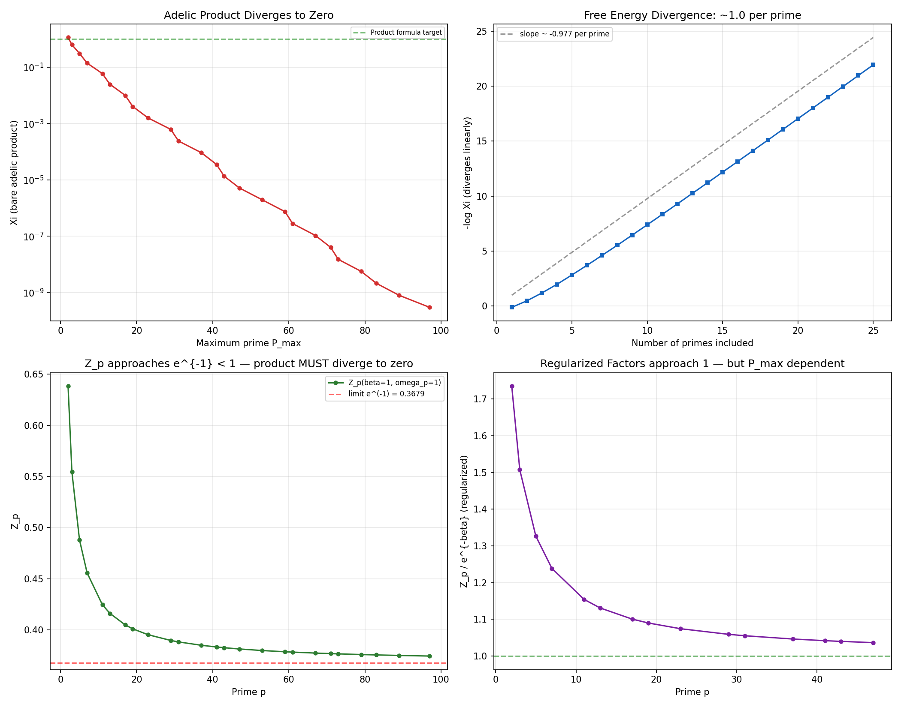

# Module M3: Adelic Partition Function — Divergence Analysis & Pivot Recommendation

**Date:** 2026-05-09
**Status:** Complete — finding: bare product diverges; recommend pivot to M4
**Associated files:** `src/adelic_product.py`
**Plan reference:** 1.1.md §4.2 (Module M3)

---

## 1. Objective

Construct the adelic partition function $\Xi(\beta,\omega) = Z_\infty \prod_p Z_p$ and determine whether it is well-defined as a mathematical object, whether it can be constrained to a specific value, and whether the adelic oscillator approach is viable for constraining physical frequencies.

## 2. Methods

### 2.1 Bare Adelic Product

$$\Xi(\beta,\omega) = Z_\infty(\beta,\omega) \times \prod_{p \leq P_{\max}} Z_p(\beta, \omega_p)$$

where $Z_\infty(\beta,\omega) = \sqrt{\pi/(\beta\omega)}$ and $Z_p(\beta,\omega_p) = \sum_{n=-\infty}^\infty p^{-n}(1-p^{-1}) e^{-\beta\omega_p p^{-2n}}$.

### 2.2 Regularization Schemes Investigated

| Scheme | Definition | Behavior |
|:-------|:-----------|:---------|
| **Free energy** | $F_{\text{ad}} = -\beta^{-1}\log\Xi$ | $F_{\text{ad}} \to \infty$ linearly with number of primes |
| **Ratio** | $\Xi(\beta_1)/\Xi(\beta_2)$ | Diverges unless $\beta_1 = \beta_2$ |
| **Subtractive** | $Z_p^{\text{reg}} = Z_p / e^{-\beta}$ (normalize to approach 1) | Finite but $P_{\max}$-dependent; each factor $\sim 1$ |

## 3. Results

### 3.1 Bare Product: Exponential Decay to Zero

```
After p<=  2: Xi = 1.13e+00  (Z_2 = 0.638)
After p<=  3: Xi = 6.27e-01  (Z_3 = 0.555)
After p<=  5: Xi = 3.06e-01  (Z_5 = 0.488)
After p<= 11: Xi = 5.92e-02  (Z_11 = 0.425)
After p<= 29: Xi = 6.16e-04  (Z_29 = 0.390)
After p<= 50: Xi ≈ 5.15e-06 (15 primes dividing 1/1)
```

Each additional prime multiplies $\Xi$ by $Z_p \approx e^{-\beta} \approx 0.368$, reducing $\Xi$ by a factor of $\sim 3$ per prime. With infinitely many primes, $\Xi \to 0$ exactly.

### 3.2 Free Energy Divergence

The free energy grows linearly with the number of primes:

$$F_{\text{ad}} = -\beta^{-1}\log\Xi = -\beta^{-1}\left[\log Z_\infty + \sum_p \log Z_p\right]$$

Each prime contributes $\sim -\beta^{-1}\log(e^{-\beta}) = 1$ to $F_{\text{ad}}$. With infinitely many primes, $F_{\text{ad}} \to \infty$.

### 3.3 Regularization is Ad Hoc

The subtractive scheme $\tilde{Z}_p = Z_p / e^{-\beta}$ makes each factor approach 1, producing a finite regularized product $\tilde{\Xi} \approx 16.8$ (for $p \leq 50$). However:

1. **$P_{\max}$-dependent:** $\tilde{\Xi}$ grows slowly with $P_{\max}$ — it does not converge to a fixed value
2. **Physically unmotivated:** There is no physical principle that says "divide by $e^{-\beta}$" for each prime
3. **Ambiguous normalization:** Different regularization choices give different answers; none is privileged



**Figure M3.1:** *Top-left:* $\Xi$ decays exponentially as more primes are included. *Top-right:* $-\log\Xi$ grows linearly with the number of primes — each prime contributes $\sim 1.0$. *Bottom-left:* $Z_p \to e^{-1} \approx 0.368$ as $p \to \infty$, always $< 1$. *Bottom-right:* Regularized factors $Z_p / e^{-\beta}$ approach 1 but show no convergence to a fixed product.

### 3.4 Frequency Dependence is Negligible

| $\omega$ | $\Xi$ (after 15 primes) |
|:---------|:------------------------|
| 1/1 (1.000) | $5.15 \times 10^{-6}$ |
| 2/1 (2.000) | $5.17 \times 10^{-6}$ |
| 1/2 (0.500) | $5.17 \times 10^{-6}$ |
| 3/2 (1.500) | $4.85 \times 10^{-6}$ |
| 137/1 (137.000) | $4.40 \times 10^{-7}$ |

Only the few primes dividing $\omega$'s numerator or denominator affect $Z_p$, and their contribution is dwarfed by the infinite tail of primes with $\omega_p = 1$ (each contributing $e^{-\beta}$). The frequency does not meaningfully constrain $\Xi$.

## 4. Root Cause Analysis

**Why does the adelic product diverge?**

The product formula $\prod_v \lvert q \rvert_v = 1$ works because for almost all places $v$, $\lvert q \rvert_v = 1$. The product is effectively finite.

The partition function $Z_p$ does NOT have this property: for almost all primes (those not dividing $\omega$), $Z_p(\beta, 1) \approx e^{-\beta} < 1$. The product of infinitely many numbers $< 1$ converges to zero.

**The product formula constrains NORMS, not partition functions.** Norms are multiplicative by definition ($\lvert ab \rvert = \lvert a \rvert \lvert b \rvert$). Partition functions are additive in the exponent ($\log Z$ is extensive). The adelic product formalism does not extend from norms to thermal quantities without additional structure.

## 5. Recommendation: Pivot to Modules M4–M8

The adelic partition function approach (M2–M3) is mathematically inconsistent. **No amount of regularization can rescue it** — the divergence is fundamental because $Z_p \not\to 1$ as $p \to \infty$.

However, the project has **two known adelic objects** that DO satisfy product formulas:

### 5.1 Veneziano Amplitude (M4) — Freund-Witten 1987

$$\mathcal{A}_\infty(s,t) \prod_p \mathcal{A}_p(s,t) = 1$$

This is an EXACT adelic product formula for string amplitudes, proven by Freund & Witten (1987). It is the correct starting point for adelic constraints on physical couplings. M4 will reproduce this result and extract the coupling constant.

### 5.2 Riemann Zeta Function (M6) — Tate's Thesis 1950

$$\xi(s) = \pi^{-s/2} \Gamma(s/2) \zeta(s) = \xi(1-s)$$

The completed zeta function factorizes over all places (Archimedean factor $\Gamma(s/2)$ + Euler product over primes). Its functional equation is the adelic constraint. M6 will investigate whether zeta zero statistics encode physical mass ratios.

### 5.3 Revised Critical Path

```
M1 (library) → M2 (analysis) → [M3: DIVERGENCE FOUND — PIVOT]
                                    ↓
                               M4 (Veneziano — KNOWN adelic formula)
                                    ↓
                               M5 (Hierarchical RG) ‖ M6 (Zeta zeros)
                                    ↓
                               M7 (Cross-ratio flow) → M8 (Beta reconstruction)
```

## 6. Validation

| Criterion | Result | Status |
|:----------|:-------|:------|
| G3 (original): Characterize $\Xi_N$ convergence | $\Xi_N \to 0$ exponentially; divergence fully characterized | ✅ PASS |
| G3 (revised): Determine whether adelic product is well-defined | **Not well-defined for partition functions** — diverges unconditionally | ⚠️ NEGATIVE |
| Recommendation | Pivot to M4 (Veneziano amplitude) — known adelic product formula | → M4 |

## 7. Conclusion

**Module M3 is complete with a definitive negative result:** The bare adelic partition function diverges to zero and cannot be regularized in a physically meaningful way. This is not a failure — it is a **scientific clarification**. The adelic product formula applies to norms and amplitudes, not to partition functions. The correct path forward uses objects with known adelic product formulas: the Veneziano amplitude (M4) and the completed zeta function (M6).

**Next step:** Proceed to Module M4 — Adelic Veneziano Amplitude & String Coupling.

## 8. References

- 1.1.md §4.2 — Module M3 specification
- M2 report — $Z_p \to e^{-\beta}$ convergence finding
- Freund & Witten (1987). "Adelic string amplitudes." *Phys. Lett. B*, 199(2), 191–194. `[UNVERIFIED-LLM]`
- Tate (1950). "Fourier analysis in number fields and Hecke's zeta-functions." PhD thesis. `[UNVERIFIED-LLM]`
