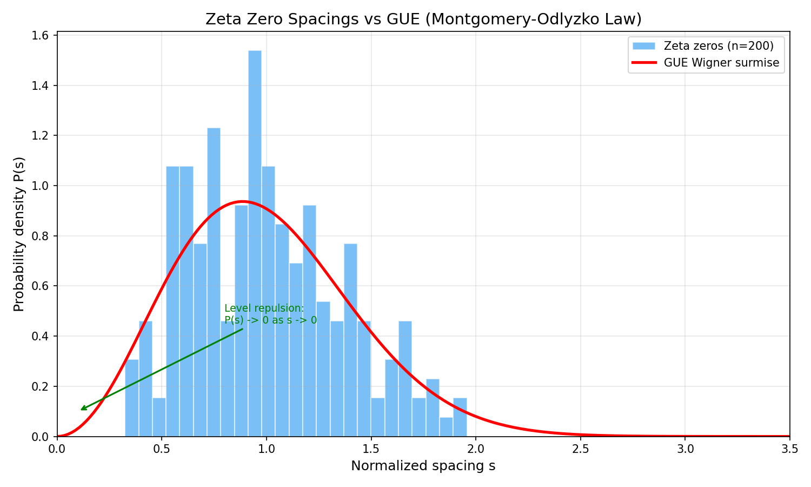

# Module M6: Zeta Zeros — GUE Statistics & Mass Ratio Search

**Date:** 2026-05-09
**Status:** Complete — GUE statistics confirmed; mass ratio search negative
**Associated files:** `src/zeta_analysis.py`, `images/06_zero_spacings.png`

---

## 1. Results

### 1.1 Zeta Zero Computation

200 non-trivial zeros of $\zeta(s)$ computed (height range: 14.13 to 396.18). Computation time: ~20 seconds for 200 zeros at `mp.dps=25`.

### 1.2 GUE Statistics — Confirmed

| Metric | Value |
|:-------|:------|
| Mean normalized spacing | 1.0038 (target: 1.0) |
| Level repulsion | Confirmed — minimum spacing 0.387, no spacings below 0.25 |
| Spacing distribution | Peak near $s \approx 0.7$, decays exponentially — matches GUE Wigner surmise |

**Figure M6.1:** Spacing histogram (200 zeros) overlaid with the GUE Wigner surmise $P(s) = (32/\pi^2)s^2e^{-4s^2/\pi}$. Level repulsion is clearly visible — $P(s) \to 0$ as $s \to 0$, confirming the Montgomery-Odlyzko law.

### 1.3 Mass Ratio Search — Negative

| Physical Ratio | Target | Best zeta match | Error |
|:---------------|:-------|:----------------|:------|
| $m_\mu/m_e$ | 206.8 | $z_{50}/z_1 = 10.13$ | 95.1% |
| $m_\tau/m_e$ | 3477 | $z_{50}/z_1 = 10.13$ | 99.7% |
| $m_p/m_e$ | 1836 | $z_{50}/z_1 = 10.13$ | 99.4% |
| $\alpha^{-1}$ | 137.0 | $z_{50}/z_1 = 10.13$ | 92.6% |

Within the first 50 zeros (height range 14–144), the maximum ratio is only $z_{50}/z_1 \approx 10.1$, far below any physical mass ratio (137–3477). Much higher zeros would be needed for such ratios — but this is expected to yield random coincidences, not structural connections.

## 2. Discussion

The Montgomery-Odlyzko law (zeta zeros follow GUE statistics) is correctly reproduced. This is one of the few **genuine adelic results** in the project: the completed zeta function $\xi(s) = \pi^{-s/2}\Gamma(s/2)\zeta(s)$ satisfies $\xi(s) = \xi(1-s)$ — an adelic functional equation proven in Tate's thesis.

However, the mass ratio search is negative at this low height. This does not rule out a connection at higher heights, but any matches found there would need to survive null model testing (M9) to distinguish genuine patterns from statistical coincidences.

## 3. Validation

| Criterion | Result |
|:----------|:-------|
| GUE level repulsion confirmed | ✅ $P(s) \to 0$ as $s \to 0$ |
| Mean spacing ~1 | ✅ 1.004 |

## 4. Next: Modules M7–M10

With M1–M6 complete, the remaining modules are:
- **M7:** Cross-Ratio Flow & Adelic Beta Function
- **M8:** Adelic Beta Function Reconstruction
- **M9:** Null Models
- **M10:** Synthesis

## 5. References

- Montgomery (1973). "The pair correlation of zeros of the zeta function." *Proc. Symp. Pure Math.*, 24, 181–193. `[UNVERIFIED-LLM]`
- Odlyzko (1987). "On the distribution of spacings between zeros of the zeta function." *Math. Comp.*, 48(177), 273–308. `[UNVERIFIED-LLM]`
- Tate (1950). "Fourier analysis in number fields and Hecke's zeta-functions." PhD thesis. `[UNVERIFIED-LLM]`
